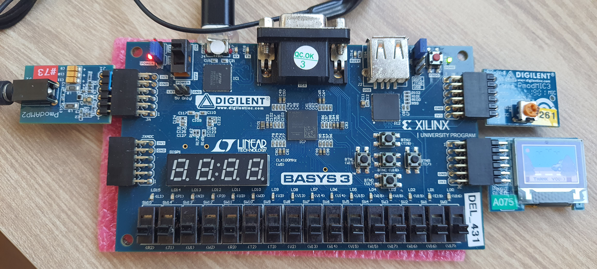

# EE2026 AY24/25 Semester 1 Project (SmartPhone-Simulator)

This group project involved the use of a Basys 3 FPGA board in conjunction with  

(1) Digilent PMOD Oled Display (96 by 64 pixel) 

(2) Digilent PMOD3 MIC

to create interactive applications which showcase the grasp of content learnt in EE2026. 

Our group decided to settle on an basic abrstraction of a smartphone UI interface which includes a lock screen and a home screen to scroll and choose from among 4 different apps:

1: Mic Audio Visualizer (Anitej Datta)

2: Music Jingle App (He Ning) 

3: TicTacToe Game (Glenn See) 

4: Catch the Ball Game (Li Dongwei)

# References Used

FPGADude. (5AD). Digital-Design/FPGA projects/star wars imperial march song at main · FPGADude/digital-design. GitHub. https://github.com/FPGADude/Digital-Design/tree/main/FPGA%20Projects/Star%20Wars%20Imperial%20March%20Song

The state machine used to create songs in the “Music - Jingle App” referenced code from this project. 

Nus-Wira. (n.d.). EE2026-FPGA-project/sources_1/new/debounce_single_pulse.V at master · Nus-Wira/EE2026-FPGA-project. GitHub. https://github.com/nus-wira/EE2026-FPGA-Project/blob/master/sources_1/new/debounce_single_pulse.v 

Used Audio_Capture module from this project to input microphone data.

The debouncing module took reference from the debouce_single_pulse.V module. 

Pereira, K. da S. (n.d.). Pixel art mobile phone interface icons. battery, Bell, speaker, phone, WIFI signal icon vector icon for 8bit game on White Background. Vecteezy. 

https://www.vecteezy.com/vector-art/9878022-pixel-art-mobile-phone-interface-icons-battery-bell-speaker-phone-wifi-signal-icon-vector-icon-for-8bit-game-on-white-background

Images of some app icons used for the home screen.

https://rgbcolorpicker.com/565  : To understand the OLED display colour format and used to make image to .mem python-based converter

https://www.pixilart.com/ 

Website used for drawing images in 96 by 64 pixel format.

Green, W. (2021, July 20). Initialize memory in Verilog. Project F. https://projectf.io/posts/initialize-memory-in-verilog/ 

https://projectf.io/posts/initialize-memory-in-verilog/ 

To import image files converted to .mem based files inside Verilog.

https://stackoverflow.com/questions/55971531/how-do-i-convert-jpg-or-png-files-to-csv-files

Convert image to CSV file

https://www.chipverify.com/verilog/verilog-arrays-memories: Understand Verilog arrays to convert .mem file to 6144 (pixels) element array, each element 16 bit deep for colour data  

